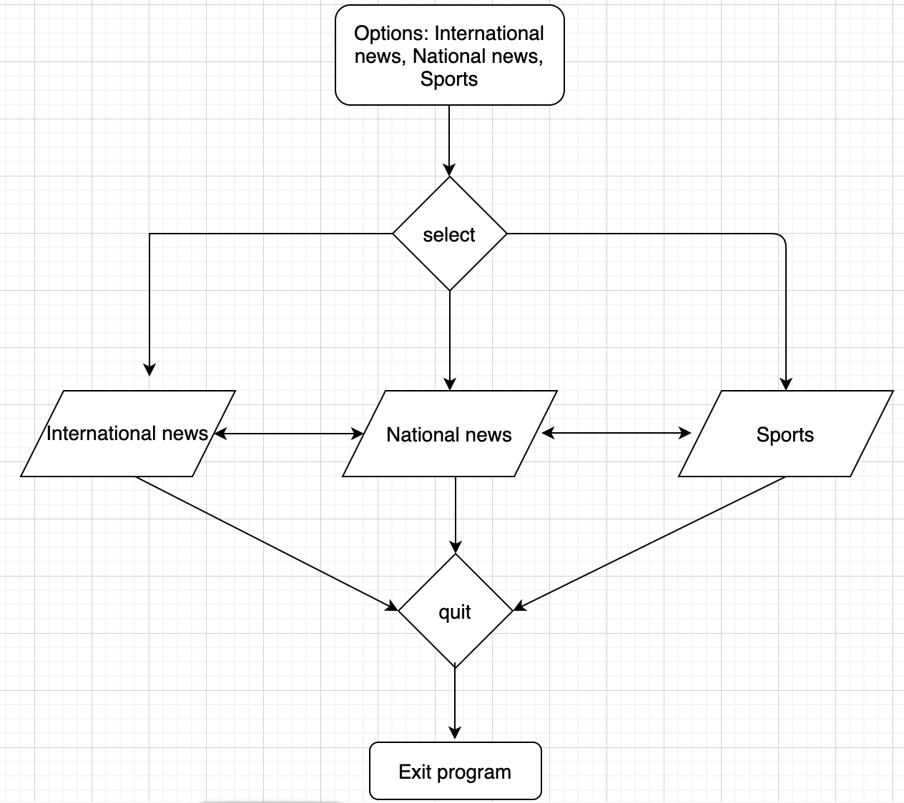

### News Express
The terminal is an essential tool for Mac and Linux and I have always been amazed by its power to accomplish  tasks in the operating system. People who work with terminal on a daily basis do not necessarily have access to a web browser, to look up content on the internet. It would be ideal to develop a handy terminal app that is capable of fetching important information from the web, such as news and sports update for a quick read/overview.

### Installation instructions
***
1. Before proceeding to download this app, it is assumed that you have Ruby installed in the system.
2. Download the file via zip or git clone into your folder of choice. In your terminal, navigate into src of this project.
3. Check whether you have [bundler gem](https://rubygems.org/gems/bundler/versions/1.11.2) installed.

You could follow either of the following two steps to run this app.
#### Option1
 Install gems that are required for this app.
```
> gem install bundler
```
Install gem dependencies
```
> bundle install
```
In the src folder, run news.rb in Ruby.
```
> ruby news.rb
```
#### Option2
In the command line, give execution permission to run_TerminalApp.sh
```
 chmod +x run_TerminalApp.sh
```
Run the run_TermialApp.sh script (please note that this command installs all gem dependencies.)
```
./run_TerminalApp.sh
```
### Statement of purpose and scope:
This app will provide three options to the user including international and national news headlines and sports. Other features, such as weather, lifestyle and finance, may be added in the future. This app will be able to display international news and sports headlines upon release. With the national headlines, it requires significant amount of effort to identify source sites of news in different countries. As such, there will be only one country (Australia) to start off when the app is launched. This app is however equipped with the ability to identify the geographical location of the user. In future updates, there will be more countries included. Some users will then have the opportunity to view their national news from the terminal. For now, Australia is set as the default.

In order to build this app, apart from implementing ruby class and modules, I will utilise a few ruby gems, including nokogiri, httparty, byegug and Geocoder. Nokogiri allows text-scraping from a web site. I am mindful of the legality side of this and therefore the source site will be fully acknowledged. Geocoder will identify the location of the user, which is imperative to display national news via the country code.

In my initial brainstorming session, I have also explored the idea of building an app on "self improvement". This app basically could ideally provide a daily dose of motivation, as well as advice on fitness, mental health and personal relationships, in the form of quotes, graphics or videos. However, this idea does not seem to be quite suitable to professionals who work with the terminal.

In the end, I believe that the news-style terminal app may be more useful and purposeful to my target audience. Through developing this app, I hope to also consolidate my ability to code using Ruby and its gem library.

### Features

### The ability of the program to fetch international news and sports headlines from a news site.
There are a few methods available on the web for scraping content from a website. After experimenting with a few, the method that I feel most comfortable and confident with is a combination of "httparty", "nokogiri" and "byebug" gems. This is the method I will adopt throughout the web scraping.

I use httparty to first obtain the the raw content from a website and pass it to nokogiri which then parses the html in a format that is extractable. Byebug is debugger that allows me to interact with the variables and select the final result. The trial code for implementation is demonstrated as below.

```
require "nokogiri"
require "httparty"
require "byebug"

def scrape
    url = "https://www.reuters.com/news/archive/worldNews"
    unparsed_page = HTTParty.get(url)
    parsed_page = Nokogiri::HTML(unparsed_page.body)    
    byebug
end
```

By inspecting the site using the chrome extension, I first locate where the target elements are. Nokogiri gem recognises the content through css. However, finding the right pattern for extraction is a highly demanding task. For the international news, I extract a headline and its content as a pair into a hash. Top five headlines are extracted and stored. Once the elements are successfully selected. They can then be displayed without the requirement of byebug.

Similar to the international headlines, sports headlines will also be extracted, stored and displayed.

### The ability of the program to fetch national news.
Following many trials and errors, I have decided to use the net/http library combined with Geocoder gem to identify the country where the user is located. First, the user's public IP can be fetched by net/http by sending request to ipify API. Geocoder gem can then take up the IP address, process it and return the country and other geographical information. Ideally, users in the countries listed will receive corresponding national news headlines.

Unlike the international news, fetching the national news requires an English news site for each country. With limited time to finish the first stage of the project, it is not feasible to include multiple countries. Hence, I have only set up a site for Australia. Australia will also be the temporary default for users who are located elsewhere, even though geocode will still locate which country the user is located. In future updates, I hope to include more countries through collaborative effort worldwide.

In terms of extracting text by css, because the css style is dramatically different from site to site, a lengthy css name with spaces can be especially challenging. With many trials and errors, I managed to finally settle on sites that work well with my trial function.

### The ability of the program to display the proper layout for viewing.
For the reading pleasure of the user, I will apply colours. The content will be displayed in text blocks with proper spacing. I will set up a menu using tty gem. The welcome screen will be ascii art. At the beginning the user will be asked to select an option from the menu. The option will lead them to the content. I will implement the slow/fast type feature on the screen for the visual effect.

### User interaction and experience
At the beginning of the program, the user will see a welcome screen which displays 3 options: international news, national news and international sports. The user will use up and down arrow keys to select an appropriate option. This ensures the consistency of the input with little room for error. The user will be able to access 5 most recent headlines with a live update almost every few hours.

### Flowchart


### Status update
Update 1: I have encountered a road block where I can display the news in terminal but there is always a deprecation warning associated with the httparty. After a few hours of troubleshooting, I have realised that, instead of using "Nokogiri::HTML(unparsed_page)", I should have used "parsed_page = Nokogiri::HTML(unparsed_page.body)"! Passing in the page body and not the page itself makes a critical difference with that deprecation error!

Update 2: Another problem I have faced is how the terminal displays the text character-by-character. Although the display is quite neat, this often causes a split word at the end of the line that continues to the start of the next line. I have extensively researched and tried different approaches. Eventually, I discover the "word_wrap" gem that allows me to display a block of text without the word split issue.  

[Trello link](https://trello.com/b/7UFhq0Hd/news-express-app)
### Implementation plan
Features   |   Checklist   |    Implementation
----------------- | ------------- | --------------
Welcome screen | ASCII art for the name of the game. The screen will pause to continue when the user is ready.  | Use ASCII art generator to generate a suitable image. The pause function will be implemented using STDIN.getch
Main menu | - The main menu will provide 4 options: a) International news, b) National news, c) International sports news, d) quit. The user will be able to use up and down arrow key to select. | TTY-prompt gem will be used to implement this function, with selected item highlighted with a colour.
Show news headlines and their content | Ideally the app will display the top 5 headlines to the user. These headlines will be evenly spaced with some colour highlight. | Use a combination of "httparty", "nokogiri" gems for web scraping. Use the "colorize" gem to add colour to the text string. Use "Geocoder" gem and built-in library "net/http" to identify the user location, which is then used to match the news of the user's country. I will effectively use commands to place line space or screen clear to ensure a good experience when browsing the news. Implement fast-type to add interest to the user when viewing the headlines.
Handling connection errors | This app relies on the internet connection to locate the user. When the internet connection fails, there will be an error. Additionally, the web scraping identifies the css selectors. In case there is a change of html/css format from the source site. The error should be noted. | These exceptions/errors will be identified and rescued.
